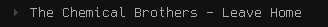

# polycmus

Simple polybar script for showing what song is playing in cmus

Started as raytruong/polybar-cmus, but rewritten for these changes:
- This script does not display playing time/progress
- This script displays play/pause icon depending on player state
- This script handles missing tags by displaying the file name instead
- This script calls cmus-remote once (as opposed to four times) per interval 



## Configuration example

Change the icon color by editing the script, default value #444.
```sh
iconcolor="#444"
```

Add the script to polybar
```ini
[module/cmus]
type = custom/script

exec = ~/.config/polybar/cmus.sh
exec-if = pgrep -x cmus
interval = 1

click-left = cmus-remote --pause
scroll-down = cmus-remote --next
scroll-up = cmus-remote --prev

label-maxlen = 100
```
